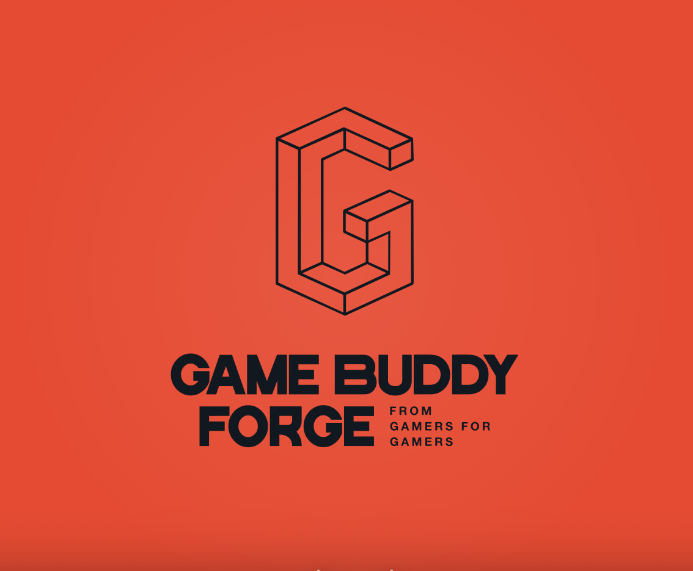

  

# 🎮 GameBuddyForge - From Gamer for Gamer! 🎮

Willkommen bei **GameBuddyForge** – Der ultimativen App für Gamer, die zusammen spielen wollen! Ob League of Legends, Fortnite oder andere Spiele – Mit GameBuddyForge findest du schnell und einfach Mitspieler für deine Lieblingsspiele. 💪

## 🌟 Vision

Unsere Mission ist es, **Communitys zu schaffen, die es in dieser Form noch nicht gibt**. Wir möchten eine Plattform bieten, die Gamer zusammenbringt und es einfach macht, Mitspieler zu finden. Keine endlosen Foren mehr durchsuchen – hier kannst du dich direkt in bestehende Suchthreads einreihen oder deine eigenen erstellen!

## 🛠️ Features

- **Wähle dein Lieblingsspiel** aus einer Liste von Games, die wir von der **FreeGamesAPI** beziehen! 🎮
- **Finde oder erstelle Such-Threads** (z.B. „Suchen 2 Mitspieler für League of Legends“) und spiele sofort mit anderen!
- **Firebase** für User-Authentifizierung, Spiele-Threads und Community-Management.
- **Von Gamern für Gamer** – Unser Ziel ist es, eine Plattform zu schaffen, die direkt auf die Bedürfnisse der Gaming-Community zugeschnitten ist. 🌐

## 🚀 Funktionen im Detail

- 🔍 **Spiele auswählen:** Durchsuche eine umfangreiche Liste von Spielen und wähle dein aktuelles Lieblingsspiel.
- 💬 **Such-Threads:** Sieh dir die Suchanfragen anderer Spieler an und trete einem Team bei oder erstelle deinen eigenen Thread, um Mitspieler zu finden!
- 📲 **Benachrichtigungen:** Bleib auf dem Laufenden, wenn jemand auf deinen Thread antwortet oder dich zu einem Spiel einlädt.
- 🔒 **Firebase-Authentifizierung:** Sichere und einfache Anmeldung und Verwaltung deiner Daten.

## 🛠️ Technologie-Stack

- **Backend:** Firebase für die Benutzer-Authentifizierung, Threads und Realtime-Updates.
- **API:** FreeGamesAPI für die Spieleliste und Details.
- **Datenbank:** Firebase Firestore für das Speichern von Spielen, Threads und User-Informationen.

## 🌍 API-Integration

- **FreeGamesAPI:** Die Liste der Spiele wird dynamisch aus der FreeGamesAPI geladen. Mehr Infos zu der API findest du hier: [FreeGamesAPI](https://freegamesapi.com)

---

**GameBuddyForge** – Die App, die Gamer zusammenbringt. **"From Gamer for Gamer!"** 🎮👾

---

### Viel Spaß und Happy Gaming! 🎮🕹️
